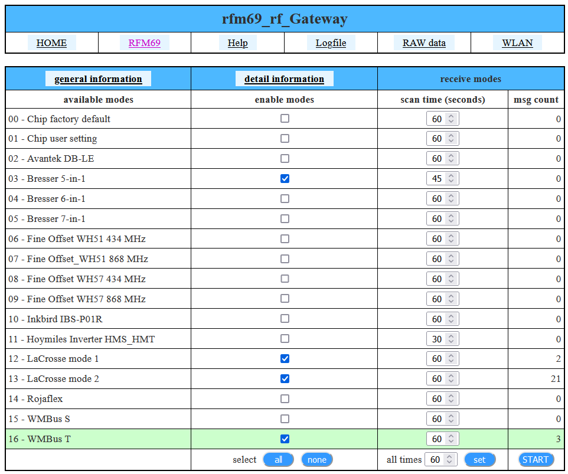
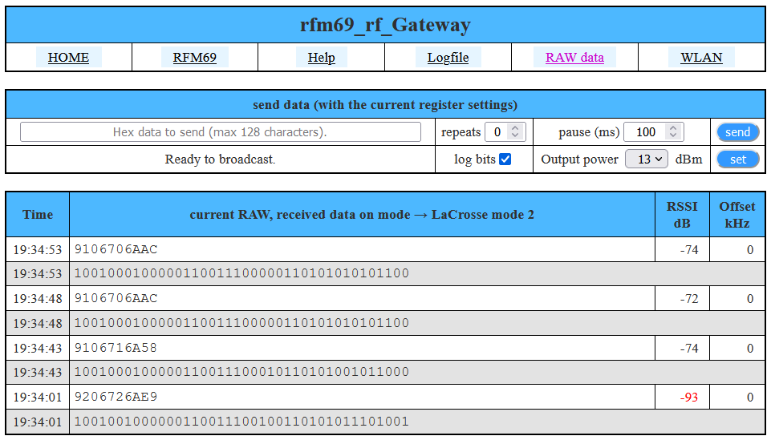

# rf_Gateway uC v2.1.5pre with CC110x/ SX1231 support

### Getting started

System to receive digital signals and provide them to other systems for demodulation. A CC110x or SX1231 is used as receiver. The cabling is analogue and compatible with the SIGNALduino. You can toggle up to 4 reception modes with a minimum time of 30 seconds. It can be operated via the WEB interface or the uC command (telnet). Standard operation is possible via FHEM.  Current reception modes are (values can be compiled in or compiled out yourself) :
  - Chip factory default (standard values according to data sheet)
  - Chip user setting
  - ASK/OOK 433 MHz
  - Avantek DB-LE
  - Bresser 5-in-1
  - Bresser 6-in-1
  - Bresser 7-in-1
  - Fine Offset WH51 434 MHz
  - Fine Offset_WH51 868 MHz
  - Fine Offset WH57 434 MHz
  - Fine Offset WH57 868 MHz
  - Inkbird IBS-P01R
  - Hoymiles Inverter HMS_HMT
  - KOPP FC
  - LaCrosse mode 1
  - LaCrosse mode 2
  - PCA301
  - Rojaflex
  - WMBus S
  - WMBus T
  - X-Sense XS01-WR
  - ... some development´s

Just clone the repo and open the project file with Visual Studio (only available for windows) or VSCode.
You can also open it with the Arduino IDE. 
Compile it and have fun.
If you are using the Arduino IDE, you have to copy all the libs into your sketch folder and modify some includes. 
required libraries: [digitalWriteFast](https://www.arduino.cc/reference/en/libraries/digitalwritefast/), [WebSockets](https://www.arduino.cc/reference/en/libraries/websockets/)

### Using cc1101_rf_Gateway in FHEM (with a CC110x chip)

1. check if you have the current SIGNALduino source in the update list   ( source: https://raw.githubusercontent.com/RFD-FHEM/RFFHEM/master/controls_signalduino.txt )
2. update your FHEM
3. define one SIGNALduino device   ( define \<name\> SIGNALduino \<device\> )
4. check the reading 'state' and if communication is successful it says 'opened'

### Using rfm69_rf_Gateway in FHEM (with a SX1231 chip)

1. ... text is being adapted
2. ... a bit patience

### Tested microcontrollers

* Arduino Nano
* Arduino Pro Mini
* ESP32 (ESP32-WROOM-32 / ESP32-WROOM-32D)
* ESP8266
* RadinoCC1101

### You found a bug

First, sorry. This software is not perfect.
1. Open a issue
-With helpful title - use descriptive keywords in the title and body so others can find your bug (avoiding duplicates).
- Which branch, what microcontroller, what setup
- Steps to reproduce the problem, with actual vs. expected results
- If you find a bug in our code, post the files and the lines. 

### Contributing

1. Open one ore more issue for your development.
2. Ask to be added to our repository or just fork it.
3. Make your modifications and test them.
4. Create a branch (git checkout -b my_branch)
5. Commit your changes (git commit -am "<some description>")
6 .Push to a developer branch (git push dev-<xyz >my_branch)
7. Open a Pull Request, put some useful informations there, what your extension does and why we should add it, reference to the open issues which are fixed whith this pull requet.

  
### some pictures with WEB interface on a ESP8266 (WEB interface only on uC with WLAN)
  (some pictures | reception can be compiled differently)
  
  -
  
  -
  
  -
  
  -
  
  -
  
